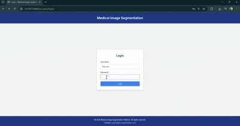

## 🧠 Medical Image Segmentation Using Deep Learning

### 📌 Overview

Medical image segmentation is a crucial deep learning application used for identifying regions of interest in medical scans such as MRI, CT, and X-rays. This project focuses on **lung segmentation** using a trained deep learning model and provides a full-stack **Django web application** for interaction.

---

### 🔧 System Components

* **Django Backend:** Manages user authentication, file uploads, and model inference.
* **Deep Learning Model (U-Net or V-Net):** Performs precise lung segmentation.
* **User Interface:** Allows users to upload images and view results.

---

### ✅ Features

* 🔐 **User Management:** Register, login, and role-based access (admin/user).
* 📤 **Image Upload:** Supports MRI, CT scans, and X-rays.
* 🧠 **Model Inference:** Deep learning segmentation using TensorFlow/Keras.
* 🖼 **Visualization:** Compare original and segmented image overlays.
* 📝 **Report Generation:** View classification history and download reports.
* 🔗 **REST API:** Upload images and retrieve results via API.

---

### 🛠 Technologies Used

| Layer           | Technology                                |
| --------------- | ----------------------------------------- |
| **Frontend**    | HTML5, CSS3                               |
| **Backend**     | Django, Django REST Framework (DRF)       |
| **ML Model**    | TensorFlow/Keras or PyTorch (U-Net/V-Net) |
| **Database**    | SQLite                                    |
| **Image Tools** | OpenCV, Pillow                            |

---

### 🚀 Installation Guide

#### ✅ Prerequisites

* Python 3.8–3.10
* Git
* pip (Python package manager)

---

### 🧾 Steps to Run Locally

1. **Clone the Repository**

   ```bash
   git clone https://github.com/Mohammed-Hamras-Sulaiman/Medical-Image--Segmentation.git
   cd Medical-Image--Segmentation
   ```

2. **Create and Activate a Virtual Environment**

   On Windows:

   ```bash
   py -3.10 -m venv venv
   venv\Scripts\activate
   ```

   On macOS/Linux:

   ```bash
   python3.10 -m venv venv
   source venv/bin/activate
   ```

3. **Install Required Packages**

   ```bash
   pip install -r requirements.txt
   ```

4. **Download the Trained Model**

   Download the pre-trained U-Net model from [Google Drive](https://drive.google.com/file/d/1dWupYFde55bYCRFhEmC1skifiNFqAJQQ/view?usp=sharing) and place it in the `models/` directory of the project.

5. **Run Migrations**

   ```bash
   python manage.py makemigrations
   python manage.py migrate
   ```

6. **(Optional) Create Your Own Superuser**

   ```bash
   python manage.py createsuperuser
   ```

7. **Run the Development Server**

   ```bash
   python manage.py runserver
   ```

8. **Open in Browser**

   Visit [http://127.0.0.1:8000/](http://127.0.0.1:8000/)

---

### 🔐 Default Credentials for Testing

| Role        | Username    | Password   |
| ----------- | ----------- | ---------- |
| Test User   | `Test_user` | `Test@123` |
| Admin Login | `admin`     | `admin`    |

Use these credentials to log in and test the system functionality.

---

### 🎥 Video Demo

Check out the video demonstration of the lung segmentation process in the project:



---


